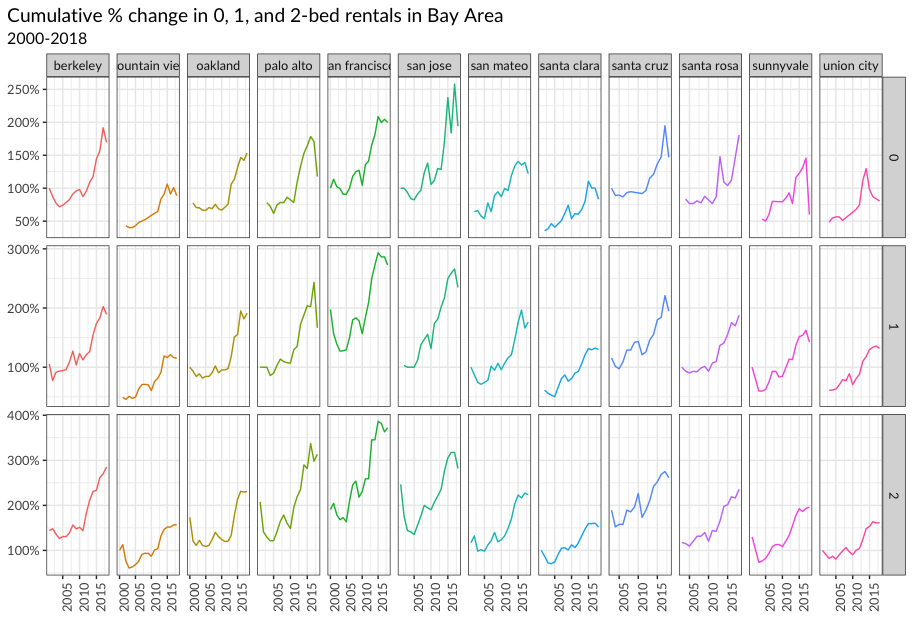

```{r, setup, echo=FALSE}
knitr::opts_chunk$set(
  message = FALSE, 
  warning = FALSE, 
  tidy=FALSE,     # display code as typed
  size="small")   # slightly smaller font for code
options(digits = 3)

# default figure size
knitr::opts_chunk$set(
  fig.width=6.75, 
  fig.height=6.75,
  fig.align = "center"
)
```

```{r load-libraries, warning=FALSE, message=FALSE, echo=FALSE}
library(tidyverse)  # Load ggplot2, dplyr, and all the other tidyverse packages
library(mosaic)
library(ggthemes)
library(lubridate)
library(here)
library(skimr)
library(janitor)
library(vroom)
library(tidyquant)
```

# Rents in San Francsisco 2000-2018

[Kate Pennington](https://www.katepennington.org/data) created a panel of historic Craigslist rents by scraping posts archived by the Wayback Machine. You can read more about her work here

[What impact does new housing have on rents, displacement, and gentrification in the surrounding neighborhood? Read our interview with economist Kate Pennington about her article, "Does Building New Housing Cause Displacement?:The Supply and Demand Effects of Construction in San Francisco."](https://matrix.berkeley.edu/research-article/kate-pennington-on-gentrification-and-displacement-in-san-francisco/)

In our case, we have a clean(ish) dataset with about 200K rows that correspond to Craigslist listings for renting properties in the greater SF area. The data dictionary is as follows

| variable    | class     | description           |
|-------------|-----------|-----------------------|
| post_id     | character | Unique ID             |
| date        | double    | date                  |
| year        | double    | year                  |
| nhood       | character | neighborhood          |
| city        | character | city                  |
| county      | character | county                |
| price       | double    | price in USD          |
| beds        | double    | n of beds             |
| baths       | double    | n of baths            |
| sqft        | double    | square feet of rental |
| room_in_apt | double    | room in apartment     |
| address     | character | address               |
| lat         | double    | latitude              |
| lon         | double    | longitude             |
| title       | character | title of listing      |
| descr       | character | description           |
| details     | character | additional details    |

The dataset was used in a recent [tidyTuesday](https://github.com/rfordatascience/tidytuesday) project.

```{r}
# download directly off tidytuesdaygithub repo

rent <- readr::read_csv('https://raw.githubusercontent.com/rfordatascience/tidytuesday/master/data/2022/2022-07-05/rent.csv')

```

What are the variable types? Do they all correspond to what they really are? Which variables have most missing values?

```{r skim_data}
# YOUR CODE GOES HERE
skimr::skim(rent)

```

Make a plot that shows the top 20 cities in terms of % of classifieds between 2000-2018. You need to calculate the number of listings by city, and then convert that number to a %.

The final graph should look like this

```{r top_cities}
# YOUR CODE GOES HERE


```

Make a plot that shows the evolution of median prices in San Francisco for 0, 1, 2, and 3 bedrooms listings. The final graph should look like this


```{r sf_median_prices}

# YOUR CODE GOES HERE


```

Finally, make a plot that shows median rental prices for the top 12 cities in the Bay area. Your final graph should look like this


```{r spirit_plot}
# YOUR CODE GOES HERE

```

What can you infer from these plots? Don't just explain what's in the graph, but speculate or tell a short story (1-2 paragraphs max).

> TYPE YOUR ANSWER AFTER (AND OUTSIDE!) THIS BLOCKQUOTE.

# Analysis of movies- IMDB dataset

We will look at a subset sample of movies, taken from the [Kaggle IMDB 5000 movie dataset](https://www.kaggle.com/carolzhangdc/imdb-5000-movie-dataset)

```{r,load_movies, warning=FALSE, message=FALSE, eval=FALSE}

movies <- read_csv(here::here("data", "movies.csv"))
glimpse(movies)

```

Besides the obvious variables of `title`, `genre`, `director`, `year`, and `duration`, the rest of the variables are as follows:

-   `gross` : The gross earnings in the US box office, not adjusted for inflation
-   `budget`: The movie's budget
-   `cast_facebook_likes`: the number of facebook likes cast memebrs received
-   `votes`: the number of people who voted for (or rated) the movie in IMDB
-   `reviews`: the number of reviews for that movie
-   `rating`: IMDB average rating

## Use your data import, inspection, and cleaning skills to answer the following:

-   Are there any missing values (NAs)? Are all entries distinct or are there duplicate entries?
-   Produce a table with the count of movies by genre, ranked in descending order
-   Produce a table with the average gross earning and budget (`gross` and `budget`) by genre. Calculate a variable `return_on_budget` which shows how many \$ did a movie make at the box office for each \$ of its budget. Ranked genres by this `return_on_budget` in descending order
-   Produce a table that shows the top 15 directors who have created the highest gross revenue in the box office. Don't just show the total gross amount, but also the mean, median, and standard deviation per director.
-   Finally, ratings. Produce a table that describes how ratings are distributed by genre. We don't want just the mean, but also, min, max, median, SD and some kind of a histogram or density graph that visually shows how ratings are distributed.

## Use `ggplot` to answer the following

-   Examine the relationship between `gross` and `cast_facebook_likes`. Produce a scatterplot and write one sentence discussing whether the number of facebook likes that the cast has received is likely to be a good predictor of how much money a movie will make at the box office. What variable are you going to map to the Y- and X- axes?

```{r, gross_on_fblikes}

```

-   Examine the relationship between `gross` and `budget`. Produce a scatterplot and write one sentence discussing whether budget is likely to be a good predictor of how much money a movie will make at the box office.

```{r, gross_on_budget}

```

-   Examine the relationship between `gross` and `rating`. Produce a scatterplot, faceted by `genre` and discuss whether IMDB ratings are likely to be a good predictor of how much money a movie will make at the box office. Is there anything strange in this dataset?

```{r, gross_on_rating}

```

# Returns of financial stocks

> You may find useful the material on [finance data sources](https://mam2023.netlify.app/reference/finance_data/).

We will use the `tidyquant` package to download historical data of stock prices, calculate returns, and examine the distribution of returns.

We must first identify which stocks we want to download data for, and for this we must know their ticker symbol; Apple is known as AAPL, Microsoft as MSFT, McDonald's as MCD, etc. The file `nyse.csv` contains 508 stocks listed on the NYSE, their ticker `symbol`, `name`, the IPO (Initial Public Offering) year, and the sector and industry the company is in.

```{r load_nyse_data, message=FALSE, warning=FALSE}
nyse <- read_csv(here::here("data","nyse.csv"))
```

Based on this dataset, create a table and a bar plot that shows the number of companies per sector, in descending order

```{r companies_per_sector}

# YOUR CODE GOES HERE


```

Next, let's choose some stocks and their ticker symbols and download some data. You **MUST** choose 6 different stocks from the ones listed below; You should, however, add `SPY` which is the SP500 ETF (Exchange Traded Fund).

```{r get_price_data, message=FALSE, warning=FALSE, cache=TRUE}
# Notice the cache=TRUE argument inthe chunk options. Because getting data is time consuming, 
# cache=TRUE means that once it downloads data, the chunk will not run again next time you knit your Rmd

myStocks <- c("AAPL","JPM","DIS","DPZ","ANF","TSLA","XOM","SPY" ) %>%
  tq_get(get  = "stock.prices",
         from = "2011-01-01",
         to   = "2022-08-31") %>%
  group_by(symbol) 

glimpse(myStocks) # examine the structure of the resulting data frame
```

Financial performance analysis depend on returns; If I buy a stock today for 100 and I sell it tomorrow for 101.75, my one-day return, assuming no transaction costs, is 1.75%. So given the adjusted closing prices, our first step is to calculate daily and monthly returns.

```{r calculate_returns, message=FALSE, warning=FALSE, cache=TRUE}
#calculate daily returns
myStocks_returns_daily <- myStocks %>%
  tq_transmute(select     = adjusted, 
               mutate_fun = periodReturn, 
               period     = "daily", 
               type       = "log",
               col_rename = "daily_returns",
               cols = c(nested.col))  

#calculate monthly  returns
myStocks_returns_monthly <- myStocks %>%
  tq_transmute(select     = adjusted, 
               mutate_fun = periodReturn, 
               period     = "monthly", 
               type       = "arithmetic",
               col_rename = "monthly_returns",
               cols = c(nested.col)) 

#calculate yearly returns
myStocks_returns_annual <- myStocks %>%
  group_by(symbol) %>%
  tq_transmute(select     = adjusted, 
               mutate_fun = periodReturn, 
               period     = "yearly", 
               type       = "arithmetic",
               col_rename = "yearly_returns",
               cols = c(nested.col))
```

Create a table where you summarise monthly returns for each of the stocks and `SPY`; min, max, median, mean, SD.

```{r summarise_monthly_returns}

# YOUR CODE GOES HERE

```

Plot a density plot, using `geom_density()`, for each of the stocks

```{r density_monthly_returns}

# YOUR CODE GOES HERE

```

What can you infer from this plot? Which stock is the riskiest? The least risky?

> TYPE YOUR ANSWER AFTER (AND OUTSIDE!) THIS BLOCKQUOTE.

Finally, make a plot that shows the expected monthly return (mean) of a stock on the Y axis and the risk (standard deviation) in the X-axis. Please use `ggrepel::geom_text_repel()` to label each stock

```{r risk_return_plot}
# YOUR CODE GOES HERE

```

What can you infer from this plot? Are there any stocks which, while being riskier, do not have a higher expected return?

> TYPE YOUR ANSWER AFTER (AND OUTSIDE!) THIS BLOCKQUOTE.

# On your own: Spotify

Spotify have an API, an Application Programming Interface. APIs are ways for computer programs to talk to each other. So while we use Spotify app to look up songs and artists, computers use the Spotify API to talk to the spotify server. There is an R package that allows R to talk to this API: [`spotifyr`](https://www.rcharlie.com/spotifyr/). One of your team members, need to sign up and get a [Spotify developer account](https://developer.spotify.com/dashboard/) and then you can download data about one's Spotify usage. A detailed article on how to go about it can be found here [Explore your activity on Spotify with R and *spotifyr*](https://towardsdatascience.com/explore-your-activity-on-spotify-with-r-and-spotifyr-how-to-analyze-and-visualize-your-stream-dee41cb63526)

If you do not want to use the API, you can download a sample of over 32K songs by having a look at <https://github.com/rfordatascience/tidytuesday/blob/master/data/2020/2020-01-21/readme.md>

```{r, download_spotify_data}

spotify_songs <- readr::read_csv('https://raw.githubusercontent.com/rfordatascience/tidytuesday/master/data/2020/2020-01-21/spotify_songs.csv')


```

The data dictionary can be found below

| **variable**             | **class** | **description**                                                                                                                                                                                                                                                                                                                                                                                                                                                                                                    |
|-------------|-------------|-----------------------------------------------|
| track_id                 | character | Song unique ID                                                                                                                                                                                                                                                                                                                                                                                                                                                                                                     |
| track_name               | character | Song Name                                                                                                                                                                                                                                                                                                                                                                                                                                                                                                          |
| track_artist             | character | Song Artist                                                                                                                                                                                                                                                                                                                                                                                                                                                                                                        |
| track_popularity         | double    | Song Popularity (0-100) where higher is better                                                                                                                                                                                                                                                                                                                                                                                                                                                                     |
| track_album_id           | character | Album unique ID                                                                                                                                                                                                                                                                                                                                                                                                                                                                                                    |
| track_album_name         | character | Song album name                                                                                                                                                                                                                                                                                                                                                                                                                                                                                                    |
| track_album_release_date | character | Date when album released                                                                                                                                                                                                                                                                                                                                                                                                                                                                                           |
| playlist_name            | character | Name of playlist                                                                                                                                                                                                                                                                                                                                                                                                                                                                                                   |
| playlist_id              | character | Playlist ID                                                                                                                                                                                                                                                                                                                                                                                                                                                                                                        |
| playlist_genre           | character | Playlist genre                                                                                                                                                                                                                                                                                                                                                                                                                                                                                                     |
| playlist_subgenre        | character | Playlist subgenre                                                                                                                                                                                                                                                                                                                                                                                                                                                                                                  |
| danceability             | double    | Danceability describes how suitable a track is for dancing based on a combination of musical elements including tempo, rhythm stability, beat strength, and overall regularity. A value of 0.0 is least danceable and 1.0 is most danceable.                                                                                                                                                                                                                                                                       |
| energy                   | double    | Energy is a measure from 0.0 to 1.0 and represents a perceptual measure of intensity and activity. Typically, energetic tracks feel fast, loud, and noisy. For example, death metal has high energy, while a Bach prelude scores low on the scale. Perceptual features contributing to this attribute include dynamic range, perceived loudness, timbre, onset rate, and general entropy.                                                                                                                          |
| key                      | double    | The estimated overall key of the track. Integers map to pitches using standard Pitch Class notation . E.g. 0 = C, 1 = C♯/D♭, 2 = D, and so on. If no key was detected, the value is -1.                                                                                                                                                                                                                                                                                                                            |
| loudness                 | double    | The overall loudness of a track in decibels (dB). Loudness values are averaged across the entire track and are useful for comparing relative loudness of tracks. Loudness is the quality of a sound that is the primary psychological correlate of physical strength (amplitude). Values typical range between -60 and 0 db.                                                                                                                                                                                       |
| mode                     | double    | Mode indicates the modality (major or minor) of a track, the type of scale from which its melodic content is derived. Major is represented by 1 and minor is 0.                                                                                                                                                                                                                                                                                                                                                    |
| speechiness              | double    | Speechiness detects the presence of spoken words in a track. The more exclusively speech-like the recording (e.g. talk show, audio book, poetry), the closer to 1.0 the attribute value. Values above 0.66 describe tracks that are probably made entirely of spoken words. Values between 0.33 and 0.66 describe tracks that may contain both music and speech, either in sections or layered, including such cases as rap music. Values below 0.33 most likely represent music and other non-speech-like tracks. |
| acousticness             | double    | A confidence measure from 0.0 to 1.0 of whether the track is acoustic. 1.0 represents high confidence the track is acoustic.                                                                                                                                                                                                                                                                                                                                                                                       |
| instrumentalness         | double    | Predicts whether a track contains no vocals. "Ooh" and "aah" sounds are treated as instrumental in this context. Rap or spoken word tracks are clearly "vocal". The closer the instrumentalness value is to 1.0, the greater likelihood the track contains no vocal content. Values above 0.5 are intended to represent instrumental tracks, but confidence is higher as the value approaches 1.0.                                                                                                                 |
| liveness                 | double    | Detects the presence of an audience in the recording. Higher liveness values represent an increased probability that the track was performed live. A value above 0.8 provides strong likelihood that the track is live.                                                                                                                                                                                                                                                                                            |
| valence                  | double    | A measure from 0.0 to 1.0 describing the musical positiveness conveyed by a track. Tracks with high valence sound more positive (e.g. happy, cheerful, euphoric), while tracks with low valence sound more negative (e.g. sad, depressed, angry).                                                                                                                                                                                                                                                                  |
| tempo                    | double    | The overall estimated tempo of a track in beats per minute (BPM). In musical terminology, tempo is the speed or pace of a given piece and derives directly from the average beat duration.                                                                                                                                                                                                                                                                                                                         |
| duration_ms              | double    | Duration of song in milliseconds                                                                                                                                                                                                                                                                                                                                                                                                                                                                                   |

In this dataset, there are only 6 types of `playlist_genre` , but we can still try to perform EDA on this dataset.

Produce a one-page summary describing this dataset. Here is a non-exhaustive list of questions:

1.  What is the distribution of songs' popularity (`track_popularity`). Does it look like a Normal distribution?
2.  There are 12 [audio features](https://developer.spotify.com/documentation/web-api/reference/object-model/#audio-features-object) for each track, including confidence measures like `acousticness`, `liveness`, `speechines`and `instrumentalness`, perceptual measures like `energy`, `loudness`, `danceability` and `valence` (positiveness), and descriptors like `duration`, `tempo`, `key`, and `mode`. How are they distributed? can you roughly guess which of these variables is closer to Normal just by looking at summary statistics?
3.  Is there any relationship between `valence` and `track_popularity`? `danceability` and `track_popularity` ?
4.  `mode` indicates the modality (major or minor) of a track, the type of scale from which its melodic content is derived. Major is represented by 1 and minor is 0. Do songs written on a major scale have higher `danceability` compared to those in minor scale? What about `track_popularity`?

# Challenge 1: Replicating a chart

The purpose of this exercise is to reproduce a plot using your `dplyr` and `ggplot2` skills. It builds on exercise 1, the San Francisco rentals data.

You have to create a graph that calculates the cumulative % change in median rental prices for 0-, 1-, and 2-bed flats between 2000 and 2018 for the top twelve cities in Bay Area, by number of ads that appeared in Craigslist. Your final graph should look like this



# Challenge 2: 2016 California Contributors plots

As discussed in class, I would like you to reproduce the plot that shows the top ten cities in highest amounts raised in political contributions in California during the 2016 US Presidential election.

```{r challenge2, echo=FALSE, out.width="100%"}
knitr::include_graphics(here::here("images", "challenge2.png"), error = FALSE)
```

To get this plot, you must join two dataframes; the one you have with all contributions, and data that can translate zipcodes to cities. You can find a file with all US zipcodes, e.g., here <http://www.uszipcodelist.com/download.html>.

The easiest way would be to create two plots and then place one next to each other. For this, you will need the `patchwork` package. <https://cran.r-project.org/web/packages/patchwork/index.html>

While this is ok, what if one asked you to create the same plot for the top 10 candidates and not just the top two? The most challenging part is how to reorder within categories, and for this you will find Julia Silge's post on [REORDERING AND FACETTING FOR GGPLOT2](https://juliasilge.com/blog/reorder-within/) useful.

```{r, load_CA_data, warnings= FALSE, message=FALSE}
# Make sure you use vroom() as it is significantly faster than read.csv()
CA_contributors_2016 <- vroom::vroom(here::here("data","CA_contributors_2016.csv"))


```

# Deliverables

There is a lot of explanatory text, comments, etc. You do not need these, so delete them and produce a stand-alone document that you could share with someone. Knit the edited and completed R Markdown file as an HTML document (use the "Knit" button at the top of the script editor window) and upload it to Canvas.

# Details

-   Who did you collaborate with: TYPE NAMES HERE
-   Approximately how much time did you spend on this problem set: ANSWER HERE
-   What, if anything, gave you the most trouble: ANSWER HERE

**Please seek out help when you need it,** and remember the [15-minute rule](https://mam2022.netlify.app/syllabus/#the-15-minute-rule){target="_blank"}. You know enough R (and have enough examples of code from class and your readings) to be able to do this. If you get stuck, ask for help from others, post a question on Slack-- and remember that I am here to help too!

> As a true test to yourself, do you understand the code you submitted and are you able to explain it to someone else?

# Rubric

Check minus (1/5): Displays minimal effort. Doesn't complete all components. Code is poorly written and not documented. Uses the same type of plot for each graph, or doesn't use plots appropriate for the variables being analyzed.

Check (3/5): Solid effort. Hits all the elements. No clear mistakes. Easy to follow (both the code and the output).

Check plus (5/5): Finished all components of the assignment correctly and addressed both challenges. Code is well-documented (both self-documented and with additional comments as necessary). Used tidyverse, instead of base R. Graphs and tables are properly labelled. Analysis is clear and easy to follow, either because graphs are labeled clearly or you've written additional text to describe how you interpret the output.
